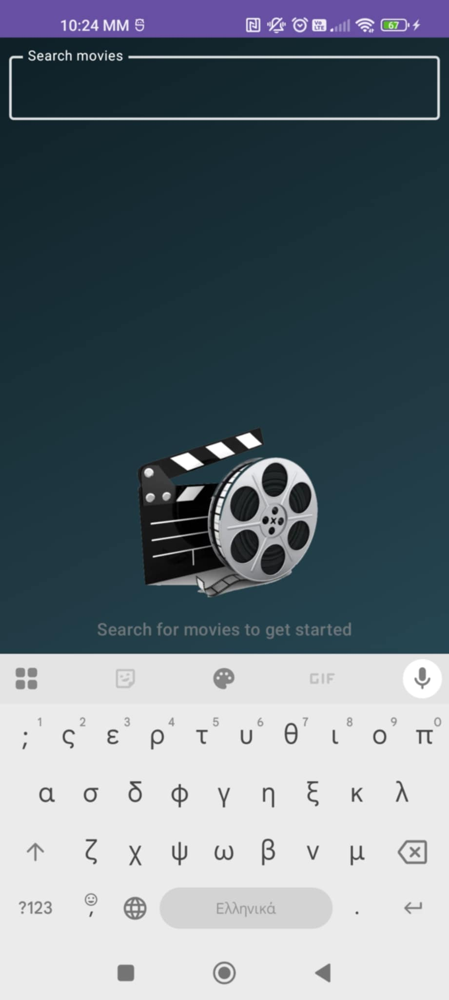
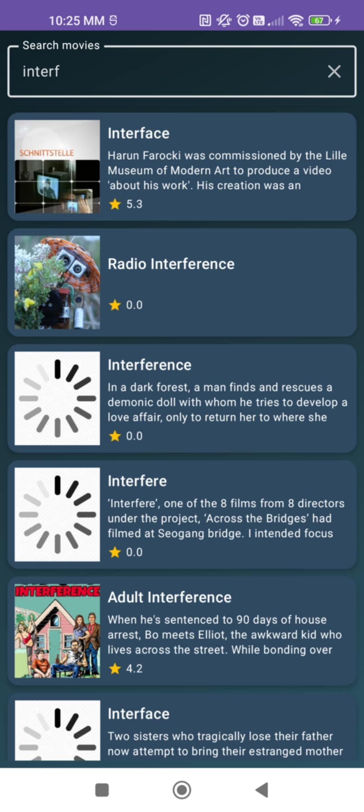
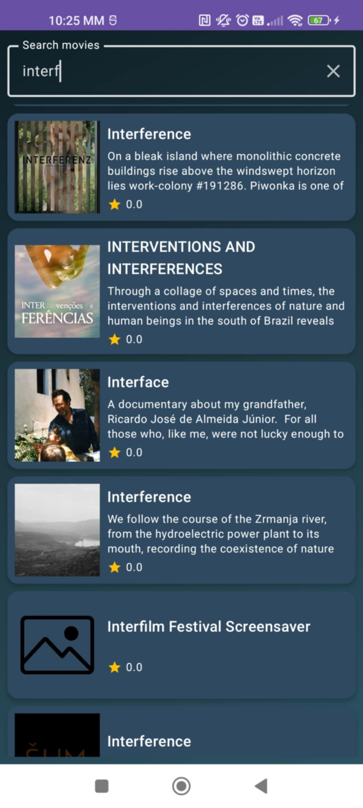
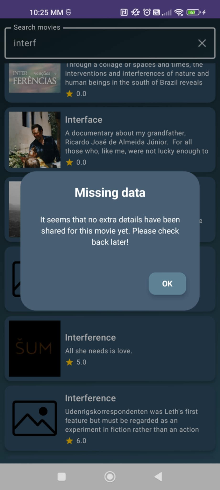
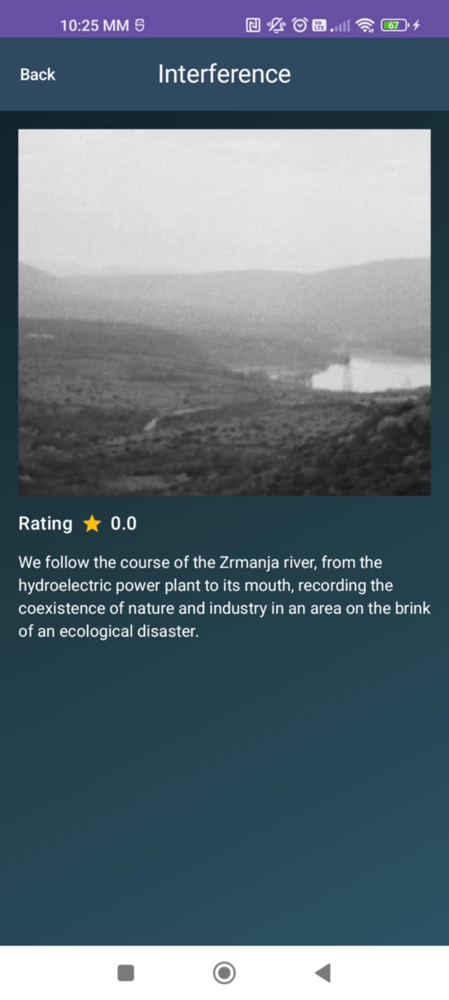

# 🎬 MovieList App

> Jetpack Compose Android app for searching movies using **The Movie Database (TMDB)** API — built with **Clean Architecture**, **Hilt**, **Retrofit**, **Paging 3**, and **Kotlin Coroutines**.

---

## 📱 Screenshots

| 							Screen 									| 							Description 							|
|------------------------------------------------------------------	|------------------------------------------------------------------	|
| 								| Splash initial screen												|
| 								| Default search screen page with animated image and text			|
| 						| Search screen page with Textfield									|
| 						| Search screen page with lazy loading and placeholder images		|
| 								| Search screen page with loaded movies and pull-to-refresh action	|
| 	| Search screen page with no movie info								|
|  								| Detail screen with the basic info of a Movie						|

---

## 🎥 Demo Video

[

---

## 🧱 Project Structure

app/
└── com.example.movielist/
    ├── core/
    │   └── di/
    │       📦 NetworkModule.kt          → Provides Retrofit, OkHttp & Moshi dependencies
    │       📦 RepositoryModule.kt       → Binds MovieRepositoryImpl to MovieRepository (Hilt)
    │
    ├── data/
    │   ├── mapper/
    │   │   🧩 MovieMapper.kt            → Converts MovieDto → Movie (Domain model)
    │   │
    │   ├── remote/
    │   │   ├── api/
    │   │   │   🌐 TmdbApi.kt            → Retrofit interface for TMDB endpoints
    │   │   │
    │   │   ├── dto/
    │   │   │   📄 MoviesDto.kt          → Network data models (MovieDto, MoviesDto)
    │   │   │
    │   │   └── 🔁 MoviesPagingSource.kt → PagingSource for incremental API loading
    │   │
    │   └── repository/
    │       📂 MovieRepositoryImpl.kt    → Repository implementation (calls TmdbApi)
    │
    ├── domain/
    │   ├── model/
    │   │   🎞️ Movie.kt                 → Domain data class (used across app)
    │   │
    │   ├── repository/
    │   │   🔗 MovieRepository.kt        → Abstraction for repository layer
    │   │
    │   └── usecase/
    │       ⚙️ SearchMoviesUseCase.kt    → Business logic for movie search
    │
    ├── presentation/
    │   ├── detail/
    │   │   🎬 DetailScreen.kt           → UI for single movie details
    │   │
    │   ├── search/
    │   │   🔍 SearchScreen.kt           → Main screen (search bar + movie list)
    │   │   🧠 SearchViewModel.kt        → ViewModel managing search logic
    │   │
    │   ├── splash/
    │   │   💫 SplashScreen.kt           → Initial loading animation (startup)
    │   │
    │   ├── theme/
    │   │   🎨 Color.kt                  → Custom color palette
    │   │   🧱 MovieBackground.kt        → Gradient background component
    │   │   🎭 Theme.kt                  → Material3 theme definitions (dark/light)
    │   │
    │   ├── ui/
    │   │   ├── components/
    │   │   │   🧩 MovieElements.kt      → Reusable UI composables (poster, text, stars)
    │   │   │   🪶 ErrorState.kt, InfoDialog.kt, LoadingIndicator.kt, etc.
    │   │   │                            → Common UI states and helpers
    │   │   │
    │   │   📱 MovieApp.kt               → Navigation host (Search → Detail)
    │   │
    │   ├── 🏠 MainActivity.kt           → Entry point Activity (Compose host + Hilt)
    │   └── 🚀 MovieListApp.kt           → Application class with @HiltAndroidApp
    │
    ├── test/
    │   ├── MovieMapperTest.kt           → Tests DTO → Domain mapping correctness
    │   ├── MoviesPagingSourceTest.kt    → Tests API paging & error handling
    │   ├── SearchMoviesUseCaseTest.kt   → Verifies repository → usecase interaction
    │   └── SearchViewModelTest.kt       → Unit tests ViewModel logic using fake repo
    │
    └── androidTest/
        (📭 Empty — UI tests not implemented)

---

## ⚙️ Setup Instructions

### 1️. Clone the Repository

```bash
git clone https://github.com/MikeAndroulakis/tmdb-movie-list.git
```
### 2. Add API Keys
Create or edit your **`gradle.properties`** file and add:

```
TMDB_API_KEY=YOUR_API_KEY_HERE
TMDB_BASE_URL=https://api.themoviedb.org/3/
```
💡 Without these keys, the app won’t fetch any movie data.

### 3. Requirements

| 		Tool         | 			Version			|
| ------------------ | ------------------------	|
| **Android Studio** | 🐨 Koala | 2025.1.1		|
| **Kotlin**         | 1.9+						|
| **JVM**            | 17						|
| **Compose BOM**    | 2024.10.00				|
| **Min SDK**        | 21						|
| **Target SDK**     | 36						|

### 4. Run the App

Select a device or emulator(the application runs on both)
Click ▶ Run in Android Studio

The app launches with a splash screen, then the movie search interface 🎥

---

##🧪 Testing
This project includes Unit Tests.

| 			Test				| 												Description																|
| -----------------------------	| ---------------------------------------------------------------------------------------------------------------------	|
| **MovieMapperTest**			| Checks MovieDto objects correctly convesion																			|
| **MoviesPagingSourceTest**	| PagingSource correctly handles API responses (returns a Page) and Server errors										|
| **SearchMoviesUseCaseTest**	| Verifies that the use case correctly delegates the search query to the repository and returns its results unchanged.	|
| **SearchViewModelTest**		| Verifies that the SearchViewModel correctly handles search queries and emits the expected results              		|

---

##🧩 Dependency Injection (Hilt)
➡️ Instructs Hilt to inject MovieRepositoryImpl whenever MovieRepository is requested.

---

## 🧰 Tech Stack

| 		**Layer** 		| 					**Library** 					| 		**Description** 		|
|:---------------------	|:------------------------------------------------- |:-----------------------------	|
| 🎨 **UI** 			| `Jetpack Compose`, `Material3`					| Declarative UI 				|
| 🧩 **DI** 			| `Hilt` 											| Dependency Injection 			|
| 🌐 **Network** 		| `Retrofit` + `Moshi` 								| REST + JSON parsing 			|
| 📜 **Pagination** 	| `Paging 3` 										| Lazy loading of movie results |
| 🖼️ **Image** 			| `Coil` 											| Image loading & caching 		|
| 🧱 **Architecture** 	| `MVVM` + Clean Architecture 						| Modular, testable design 		|
| 🧪 **Testing** 		| `JUnit4`, `Turbine`, `Mockito`, `MockWebServer` 	| Unit + flow testing 			|
| 🧭 **Navigation** 	| `Navigation Compose` 								| Compose-based routing 		|
| ⚙️ **Coroutines** 	| `Kotlin Coroutines` + `Flow` 						| Async + reactive programming 	|

---

## ⚠️ Limitations & Assumptions

- 🔑 Requires valid **TMDB API key**  
- 🧪 Only unit tests (no UI/Espresso yet)  
- 🇬🇧 Some hardcoded English strings  
- 🖼️ Images fetched via Coil with built-in memory and disk caching (no offline storing)

---
## 🚀 CI Integration

Automated testing via **GitHub Actions**:

---

### 🌈 UI Highlights

✨ Pull-to-refresh support
🎞️ Animated empty & error states
🎨 Gradient background theme
⭐ Smooth rating icons & scrolling
💬 Dialog feedback for missing data

---

### 🔮 Future Improvements

✅ Room-based offline caching
✅ Localization (EN / GR)
✅ Dark / Light theme switch
✅ Compose UI tests (MockWebServer integration)
✅ Display extra details (release date, genre, cast)
✅ Display more movie details (release date, genre, cast)

## 👨‍💻 Author

**🎬 MovieList App**  
Developed by **Michael Androulakis**

💬 *Clean Architecture • Jetpack Compose • Kotlin*  
📍 Based in Greece 🇬🇷  
🔗 [GitHub](https://github.com/MikeAndroulakis) • [LinkedIn](https://www.linkedin.com/in/michael-a-8283b4316/)