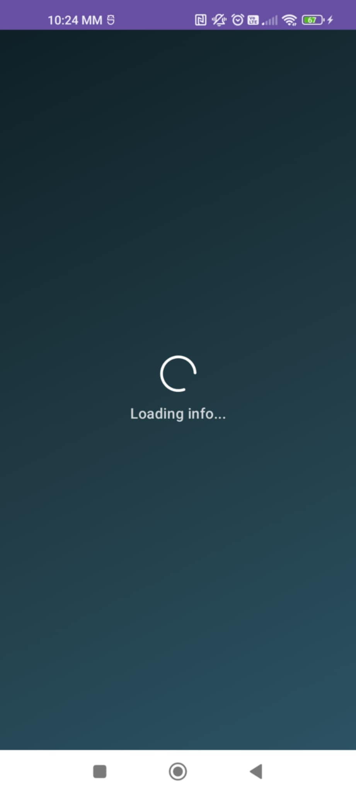

# 🎬 MovieList App

> Jetpack Compose Android app for searching movies using **The Movie Database (TMDB)** API — built with **Clean Architecture**, **Hilt**, **Retrofit**, **Paging 3**, and **Kotlin Coroutines**.

---

## 📱 Screenshots

| 							Screen 									| 							Description 							|
|------------------------------------------------------------------	|------------------------------------------------------------------	|
| 								| Splash initial screen												|
| 								| Default search screen page with animated image and text			|
| 						| Search screen page with Textfield									|
| 						| Search screen page with lazy loading and placeholder images		|
| 								| Search screen page with loaded movies and pull-to-refresh action	|
| 	| Search screen page with no movie info								|
|  								| Detail screen with the basic info of a Movie						|

---

## 🎥 Demo Video

[

---

## 🧱 Project Structure

app/
│
├── core/
│ └── di/
│ ├── NetworkModule.kt 		# Provides Retrofit & OkHttp dependencies
│ └── RepositoryModule.kt 	# Binds MovieRepositoryImpl → MovieRepository
│
├── data/
│ ├── mapper/
│ │ └── MovieMapper.kt 		# Maps DTOs → Domain models
│ │
│ ├── remote/
│ │ ├── api/
│ │ │ └── TmdbApi.kt 		# Retrofit interface for TMDB API
│ │ │
│ │ ├── dto/
│ │ │ └── MoviesDto.kt 		# Data Transfer Objects (MovieDto, MoviesDto)
│ │ │
│ │ └── MoviesPagingSource.kt # Paging source for paginated API results
│ │
│ └── repository/
│  └── MovieRepositoryImpl.kt # Repository implementation accessing TMDB API
│
├── domain/
│ ├── model/
│ │ └── Movie.kt # Core domain entity (Parcelable)
│ │
│ ├── repository/
│ │ └── MovieRepository.kt # Repository interface (abstraction layer)
│ │
│ └── usecase/
│  └── SearchMoviesUseCase.kt # Business logic for searching movies
│
├── presentation/
│ ├── detail/
│ │ └── DetailScreen.kt 	# Movie detail UI (poster, overview, rating)
│ │
│ ├── search/
│ │ ├── SearchScreen.kt 	# Main search UI with pagination
│ │ └── SearchViewModel.kt 	# ViewModel for managing search state
│ │
│ ├── splash/
│ │ └── SplashScreen.kt # Loading splash with gradient background
│ │
│ ├── theme/
│ │ ├── Color.kt 			# Color definitions
│ │ ├── MovieBackground.kt 	# Gradient background composable
│ │ └── Theme.kt 			# Material 3 color scheme setup
│ │
│ ├── ui/
│ │ ├── components/
│ │ │ └── MovieElements.kt # Shared UI components (dialogs, loading, etc.)
│ │ │
│ │ └── MovieApp.kt # Root composable (Navigation Host)
│ │
│ └── MovieListApp.kt # Hilt Application class
│
├── MainActivity.kt # App entry point (Splash → MovieApp)
│
├── com.example.movielist (test) 		# Unit tests
└── com.example.movielist (androidTest) # (empty, no UI tests)

---

## ⚙️ Setup Instructions

### 1️. Clone the Repository

```bash
git clone https://github.com/MikeAndroulakis/tmdb-movie-list.git
```
### 2. Add API Keys
Create or edit your **`gradle.properties`** file and add:

```
TMDB_API_KEY=YOUR_API_KEY_HERE
TMDB_BASE_URL=https://api.themoviedb.org/3/
```
💡 Without these keys, the app won’t fetch any movie data.

### 3. Requirements

| 		Tool         | 			Version			|
| ------------------ | ------------------------	|
| **Android Studio** | 🐨 Koala | 2025.1.1		|
| **Kotlin**         | 1.9+						|
| **JVM**            | 17						|
| **Compose BOM**    | 2024.10.00				|
| **Min SDK**        | 21						|
| **Target SDK**     | 36						|

### 4. Run the App

Select a device or emulator(the application runs on both)
Click ▶ Run in Android Studio

The app launches with a splash screen, then the movie search interface 🎥

---

##🧪 Testing
This project includes Unit Tests.

| 			Test				| 												Description																|
| -----------------------------	| ---------------------------------------------------------------------------------------------------------------------	|
| **MovieMapperTest**			| Checks MovieDto objects correctly convesion																			|
| **MoviesPagingSourceTest**	| PagingSource correctly handles API responses (returns a Page) and Server errors										|
| **SearchMoviesUseCaseTest**	| Verifies that the use case correctly delegates the search query to the repository and returns its results unchanged.	|
| **SearchViewModelTest**		| Verifies that the SearchViewModel correctly handles search queries and emits the expected results              		|

---

##🧩 Dependency Injection (Hilt)
➡️ Instructs Hilt to inject MovieRepositoryImpl whenever MovieRepository is requested.

---

## 🧰 Tech Stack

| 		**Layer** 		| 					**Library** 					| 		**Description** 		|
|:---------------------	|:------------------------------------------------- |:-----------------------------	|
| 🎨 **UI** 			| `Jetpack Compose`, `Material3`					| Declarative UI 				|
| 🧩 **DI** 			| `Hilt` 											| Dependency Injection 			|
| 🌐 **Network** 		| `Retrofit` + `Moshi` 								| REST + JSON parsing 			|
| 📜 **Pagination** 	| `Paging 3` 										| Lazy loading of movie results |
| 🖼️ **Image** 			| `Coil` 											| Image loading & caching 		|
| 🧱 **Architecture** 	| `MVVM` + Clean Architecture 						| Modular, testable design 		|
| 🧪 **Testing** 		| `JUnit4`, `Turbine`, `Mockito`, `MockWebServer` 	| Unit + flow testing 			|
| 🧭 **Navigation** 	| `Navigation Compose` 								| Compose-based routing 		|
| ⚙️ **Coroutines** 	| `Kotlin Coroutines` + `Flow` 						| Async + reactive programming 	|

---

## ⚠️ Limitations & Assumptions

- 🔑 Requires valid **TMDB API key**  
- 🧪 Only unit tests (no UI/Espresso yet)  
- 🇬🇧 Some hardcoded English strings  
- 🖼️ Images fetched via Coil with built-in memory and disk caching (no offline storing)

---
## 🚀 CI Integration

Automated testing via **GitHub Actions**:

---

### 🌈 UI Highlights

✨ Pull-to-refresh support
🎞️ Animated empty & error states
🎨 Gradient background theme
⭐ Smooth rating icons & scrolling
💬 Dialog feedback for missing data

---

### 🔮 Future Improvements

✅ Room-based offline caching
✅ Localization (EN / GR)
✅ Dark / Light theme switch
✅ Compose UI tests (MockWebServer integration)
✅ Display extra details (release date, genre, cast)
✅ Display more movie details (release date, genre, cast)

## 👨‍💻 Author

**🎬 MovieList App**  
Developed by **Michael Androulakis**

💬 *Clean Architecture • Jetpack Compose • Kotlin*  
📍 Based in Greece 🇬🇷  
🔗 [GitHub](https://github.com/MikeAndroulakis) • [LinkedIn](https://www.linkedin.com/in/michael-a-8283b4316/)